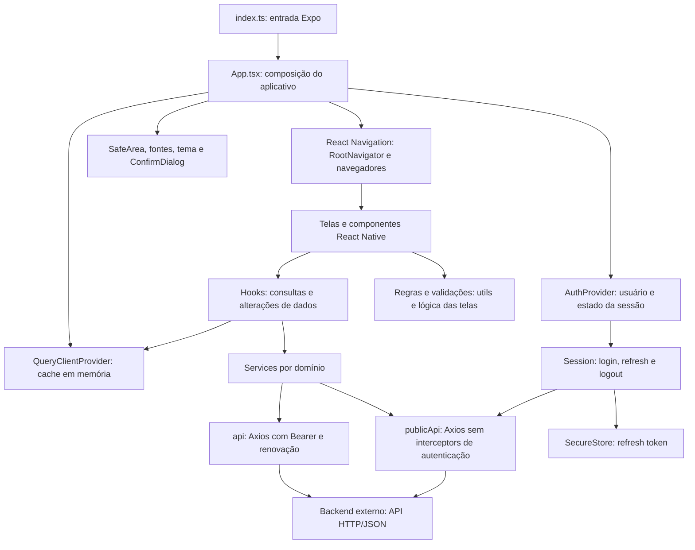
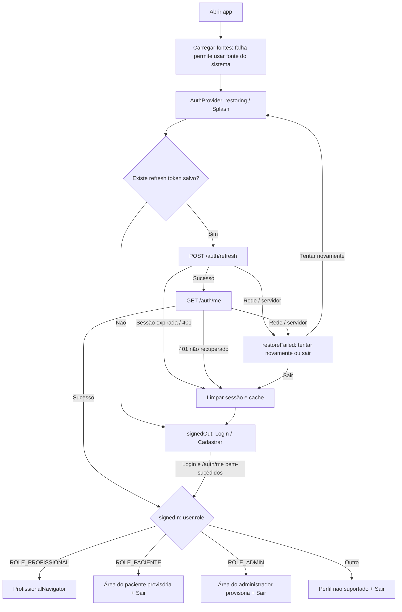
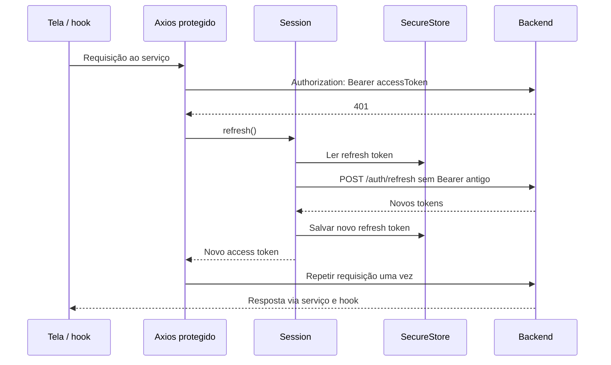
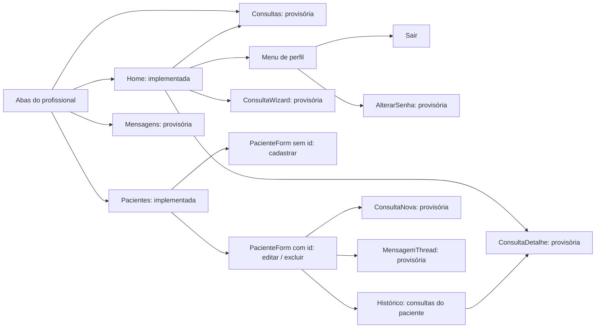

# FisioTech — arquitetura e fluxos do aplicativo mobile

Análise dos arquivos desta pasta em 05/10/2026. O código executável é a referência para o estado atual; o `MIGRATION_PLAN.md` é a referência para as funcionalidades planejadas. Esta análise é estática: não houve execução do aplicativo, dos testes ou do backend.

## 1. Visão do sistema

O FisioTech é um aplicativo de gestão de clínica de fisioterapia, com três perfis: profissional, paciente e administrador. Este repositório contém o frontend mobile em React Native/Expo, migrado de Angular/Capacitor. Conforme o README, ele consome um backend Java 21/Spring Boot existente.

O backend e seu banco de dados não estão nesta pasta. Os endpoints abaixo são as chamadas declaradas pelo frontend; a implementação interna e as permissões efetivas do servidor não foram verificadas.

| Perfil | Responsabilidade funcional | Situação no mobile |
|---|---|---|
| Profissional | Pacientes, agenda, prontuário e mensagens | Home e gestão de pacientes implementadas; outras telas provisórias |
| Paciente | Agendamento, consultas, avaliações, mensagens e perfil | Autocadastro implementado; área autenticada provisória; serviços e hooks preparados |
| Administrador | Profissionais e pacientes, incluindo vínculo com profissional | Área autenticada provisória; serviços e hooks preparados |

## 2. Arquitetura técnica atual

O aplicativo usa camadas de apresentação, navegação, estado, acesso à API e infraestrutura. As pastas são organizadas por responsabilidade técnica, com telas e serviços separados por domínio. Não há uma camada própria de repositórios ou casos de uso: os hooks chamam os serviços diretamente.

| Camada | Arquivos/pasta | Papel |
|---|---|---|
| Entrada e composição | `index.ts`, `src/App.tsx` | Registro no Expo, carregamento de fontes e composição dos providers |
| Navegação | `src/navigation/` | Decide o fluxo pela sessão e pelo perfil; abas e telas empilhadas |
| Apresentação | `src/screens/`, `src/components/` | Formulários, listas, home, estados de erro e confirmação |
| Autenticação global | `src/contexts/AuthContext.tsx` | Login, cadastro, restauração, logout e usuário atual |
| Estado dos dados remotos | `src/hooks/`, `src/api/queryClient.ts` | Queries, mutations, cache e invalidação |
| Acesso por domínio | `src/services/` | Métodos HTTP de pacientes, consultas, mensagens, avaliações e profissionais |
| Transporte e sessão | `src/api/` | Axios, interceptors, classificação de erros, sessão e leitura de Location |
| Contratos de dados | `src/types/` | Interfaces de respostas e requisições; sem validação runtime dos DTOs |
| Regras compartilhadas | `src/utils/` e arquivos `*Logic.ts` | Datas, validação, filtros e cálculos da home |
| Identidade visual | `src/theme/`, `assets/` | Cores, métricas, tipografia Inter, ícones e imagens |
| Configuração | `src/config/env.ts`, `app.json` | URL da API e configuração nativa Expo |

Stack declarada: Expo SDK 57, React Native 0.86.3, React 19.2.3, TypeScript em modo strict, React Navigation 7, TanStack Query 5 e Axios. A interface usa componentes próprios com StyleSheet, SVG e gradiente.

## 3. Abertura, autenticação e perfis

**Login:** valida email/senha → `POST /auth/login` pelo cliente público → salva refresh token e mantém access token em memória → `GET /auth/me` → limpa o cache e abre a área do perfil. Se a busca do usuário falhar durante o login, a sessão local recém-criada é apagada.

**Autocadastro:** na aba Cadastrar, informa nome/email/senha → `POST /pacientes/cadastro` → login automático → área do paciente, atualmente provisória. Email duplicado recebe mensagem de conflito (409). Se o cadastro funcionar e o login automático falhar, a tela retorna à aba Login com aviso e email preenchido.

**Logout:** lê o refresh token, apaga a credencial local e tenta revogá-la em `POST /auth/logout`. Uma falha nessa chamada HTTP é tolerada. Em seguida, o contexto remove o usuário, limpa o cache e volta ao login.

### Renovação das requisições protegidas

Renovações simultâneas compartilham uma única Promise. Não há renovação periódica pelo prazo `expiresIn`: o app renova na restauração e em resposta a 401. Refresh ausente ou recusado com 401 exige novo login. Falha de rede/servidor durante o refresh preserva a credencial para nova tentativa. Uma requisição repetida que ainda receba 401 é devolvida como erro, sem nova tentativa de refresh.

A navegação seleciona as telas pelo perfil, mas a autorização das operações também precisa ser aplicada pelo backend.

## 4. Fluxo atual do profissional

As abas são Home, Pacientes, Consultas e Mensagens. Formulários e detalhes são telas empilhadas por cima das abas, com retorno nativo à tela anterior.

### Home

Busca `GET /consultas` e `GET /pacientes`. Calcula a próxima consulta agendada/confirmada a partir do horário atual, as sessões de hoje sem canceladas e a agenda de hoje sem repetir a consulta destacada. Mostra totais, dados da agenda e atalhos para prontuário e registro clínico. Esses dois destinos ainda são provisórios.

Possui carregamento, estados vazios, erro com nova tentativa, atualização ao retornar à tela e gesto de puxar para atualizar. O menu de perfil permite sair e abrir a tela provisória de troca de senha.

### Gestão de pacientes

1. **Listar:** `GET /pacientes`; busca local por nome/email, sem diferenciar maiúsculas; atualização manual e ao retornar à lista.
2. **Cadastrar:** abre formulário sem id; valida nome/email/senha; envia apenas esses três campos em `POST /pacientes`; invalida o cache e volta à lista.
3. **Editar:** abre formulário com id; lê `GET /pacientes/{id}`; permite dados pessoais e contato; converte data DD/MM/AAAA para ISO; envia `PUT /pacientes/{id}`; invalida pacientes e consultas e volta.
4. **Senha na edição:** campo vazio vira `null`, preservando a senha atual pelo contrato esperado; senha informada é enviada para atualização.
5. **Excluir:** solicita confirmação; envia `DELETE /pacientes/{id}`; remove cache do detalhe, invalida listas e volta. Em 409, informa que há consultas ou mensagens associadas e permanece no formulário.
6. **Histórico:** busca `GET /consultas?pacienteId=...`; mostra data e status; seleção abre o detalhe provisório. Ausência de dados ou falha nessa busca oculta a seção sem bloquear o formulário.

O cadastro pelo profissional mantém a sessão do profissional. O autocadastro público cria a conta e tenta entrar como paciente.

## 5. Fluxos previstos para completar o sistema

Os fluxos abaixo vêm do plano de migração e dos serviços/hooks existentes. As telas completas ainda não estão implementadas nesta pasta.

| Perfil / módulo | Fluxo previsto | Apoio já presente |
|---|---|---|
| Profissional / consultas | Listar e filtrar → agendar → abrir detalhe/prontuário → editar ou excluir | `consultaService`, hooks e tipos; criação extrai id do header Location |
| Profissional / registro clínico | Consulta → quadro clínico → hábitos de vida → exame físico → diagnóstico/plano | Tipos clínicos e atualização de consulta; wizard ainda provisório |
| Profissional / mensagens | Caixa de entrada → paciente → conversa → enviar mensagem | `mensagemService` e hooks |
| Paciente / agendamento | Buscar profissional por nome/especialidade → escolher data → consultar horários → selecionar tipo/convênio → confirmar | `meService`, hooks de busca/disponibilidade/agendamento; tratamento de 409 esperado nas futuras telas |
| Paciente / consultas | Minhas consultas → detalhe → cancelar, remarcar ou avaliar | Serviços e hooks; avaliação ainda inexistente é representada por null em resposta a 404 |
| Paciente / mensagens | Conversas → profissional → enviar mensagem | Serviços e hooks em `/me/mensagens` |
| Paciente / perfil | Consultar dados → editar perfil → salvar | Serviços e hooks em `/me` |
| Administrador / profissionais | Listar → cadastrar → editar ou excluir | `profissionalService` e hooks |
| Administrador / pacientes | Listar → editar dados e profissional vinculado | `pacienteAdminService` e hooks |
| Todos / senha | Enviar senha atual/nova → tentar novo login → continuar ou sair se o login falhar | `useAlterarSenha`; interface ainda pendente |

O plano prevê atualização das conversas ao abrir, enviar e puxar para atualizar. Não foi encontrada implementação de WebSocket ou polling no código atual.

## 6. Domínio e comunicação com a API

Relações observáveis nos DTOs: uma consulta referencia paciente e profissional, contém quatro blocos clínicos e pode ter avaliação; mensagens também referenciam paciente e profissional. O paciente possui um vínculo opcional com profissional. Essas relações descrevem contratos do frontend, não um esquema de banco confirmado.

| Recurso | Principais rotas consumidas |
|---|---|
| Autenticação | `POST /auth/login`, `/auth/refresh`, `/auth/logout`; `GET /auth/me` |
| Pacientes do profissional | `GET/POST /pacientes`; `GET/PUT/DELETE /pacientes/{id}` |
| Autocadastro | `POST /pacientes/cadastro` |
| Consultas do profissional | `GET/POST /consultas`; `GET/PUT/DELETE /consultas/{id}` |
| Mensagens do profissional | `GET/POST /mensagens`; `GET /mensagens/caixa-entrada` |
| Avaliações | `GET /avaliacoes/consulta/{consultaId}`; `POST /avaliacoes` declarado no serviço |
| Autoatendimento | `/me`, `/me/senha`, `/me/consultas`, `/me/mensagens`, `/me/avaliacoes`, `/me/profissionais` e suas subrotas |
| Administração de pacientes | `GET /admin/pacientes`; `GET/PUT /admin/pacientes/{id}` |
| Profissionais | `GET/POST /profissionais`; `GET/PUT/DELETE /profissionais/{id}` |
| Senha profissional/admin | `PUT /profissionais/me/senha`; `PUT /admin/me/senha` |

Consulta tem tipo `PRESENCIAL` ou `ONLINE` e status `AGENDADA`, `CONFIRMADA`, `REALIZADA` ou `CANCELADA`. A presença desses valores não comprova todas as transições permitidas pelo servidor. O tipo ONLINE também não comprova integração com videoconferência.

## 7. Dados, cache e tratamento de falhas

- **Sessão:** access token somente em memória; refresh token no SecureStore; senha não é persistida.
- **Dados remotos:** cache em memória do TanStack Query. Chaves agrupadas por domínio permitem invalidar listas e detalhes após alterações.
- **Estado de tela:** formulários, filtros e abertura de menus usam estado local React.
- **Persistência:** AsyncStorage está declarado como dependência, mas não foi encontrado uso em `src`. Não há implementação observada de banco local, cache persistente ou fila de sincronização offline.
- **Cliente HTTP:** URL por `EXPO_PUBLIC_API_URL`, padrão `http://10.0.2.2:8080`; timeout de 15 segundos; respostas esperadas em JSON.
- **Repetições:** queries repetem falhas de rede/5xx até duas vezes; não repetem 4xx ou falhas desconhecidas. Mutations não possuem repetição automática do TanStack Query; uma chamada protegida ainda pode ser repetida pelo interceptor após refresh.
- **Feedback:** componentes de erro, skeletons, botões de carregamento e diálogo global de confirmação.

## 8. Entrega e evidências de qualidade disponíveis

O `app.json` identifica o Android como `com.fisiotech.app`, com orientação vertical e tema claro. O script de build gera o projeto Android via Expo prebuild, compila com Gradle e copia o APK para `build/fisiotech-1.0.0.apk`. O arquivo de build não estava presente nesta leitura. A assinatura descrita é de debug, para testes. Há configuração iOS/web, mas não foi verificada entrega nessas plataformas.

A URL da API é embutida no bundle; o servidor precisa estar acessível pelo aparelho. A configuração Android permite HTTP sem TLS para o ambiente local.

Há testes unitários de sessão/interceptors, contexto de autenticação, serviços, hooks, navegação, componentes, home e pacientes. Há testes de contrato contra backend real, separados da suíte unitária, e fluxos Maestro de abertura, autenticação, cadastro e gestão de pacientes. Os scripts de contrato/e2e criam dados no backend de desenvolvimento; não foram executados nesta análise.

## 9. Pontos de atenção da documentação

1. O README ainda resume o status como Batch 2, mas o código e o registro B4 do plano já incluem gestão de pacientes.
2. O plano preserva seções históricas e uma linha de batch sobre HTTP Basic. A implementação atual usa JWT com refresh token.
3. Serviços e hooks preparados não equivalem a telas concluídas. Consultas, mensagens, registro clínico e troca de senha do profissional ainda têm destinos provisórios; paciente e admin ainda não têm navegadores completos.
4. Este levantamento demonstra estrutura e comportamento previstos pelo código. Não comprova conectividade, execução em aparelho, sucesso dos testes, permissões do backend ou estrutura do banco.

## 10. Arquivos de referência

- Composição: `src/App.tsx` e `index.ts`.
- Sessão e perfis: `src/contexts/AuthContext.tsx`, `src/api/session.ts`, `src/api/authInterceptors.ts`, `src/services/tokenStorage.ts`, `src/navigation/RootNavigator.tsx`.
- Navegação profissional: `src/navigation/ProfissionalNavigator.tsx` e `src/navigation/types.ts`.
- Fluxos implementados: `src/screens/Login/`, `src/screens/ProfissionalHome/`, `src/screens/Pacientes/`.
- Contratos e acesso: `src/types/`, `src/services/`, `src/hooks/`, `src/api/queryClient.ts`.
- Planejamento e execução: `MIGRATION_PLAN.md`, `README.md`, `package.json`, `app.json`, `scripts/`, `.maestro/`.
